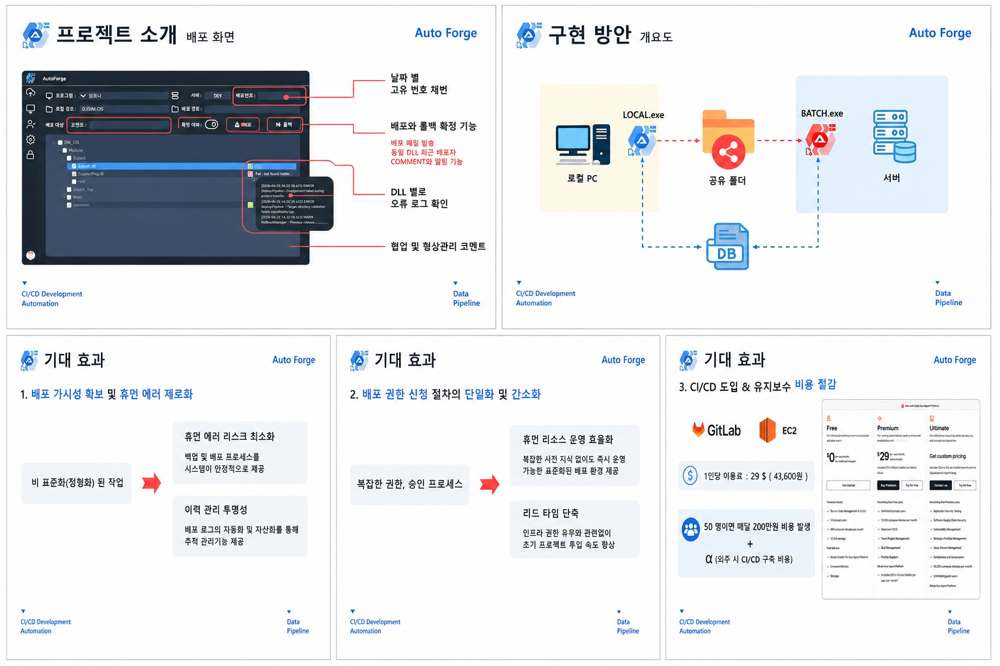
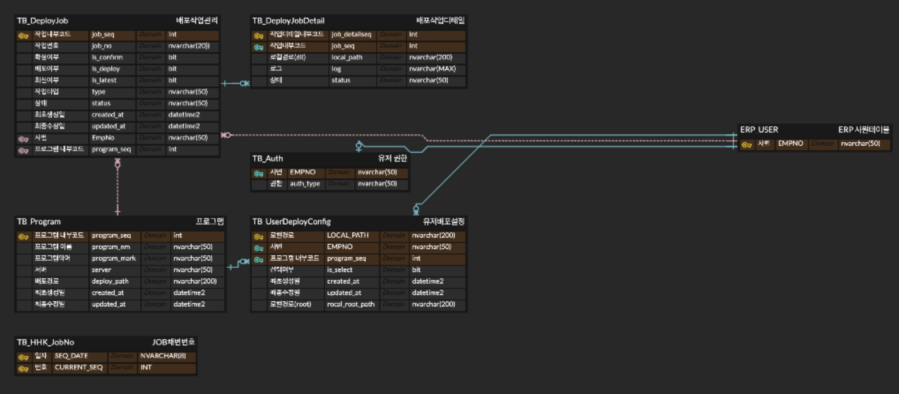

<h1 align="left">AutoForge</h1>

> AutoForge는 폐쇄망 및 보안 환경에서 기존 CI/CD 도구 활용이 어려운 제조 기업 환경을 고려하여 기획한 배포 자동화 플랫폼입니다.

배포 과정에서 발생하는 수작업을 최소화하고, 서버 상태 모니터링 및 배포 이력 관리를 통해 운영 효율성을 향상시키는 것을 목표로 하였습니다.

## 0. 개요
> 사내 중점 추진 과제 로 생각해본 기획 단계로 이미지, ERD 등 실제 내부 구현 과 다르며 개인 생각 정리를 위한 공간

## 1. 주요기능
* 배포 자동화
* 배포 이력 관리
* 배치 기반 상태 정보 수집
* 사용자 권한 관리
* 서버별 배포 현황 조회

## 2. 관련 이미지

## 3. 이슈
- 사내 서버구조가 상이한 경우 >> 각 담당자가 dll 경로를 직접 입력하면 더 간단해짐.. 초기 1회성이니 가능 .. 이후 데이터 쌓이면 템플릿 형식으로 자동화 가능

- 공유폴더 이용 보안 문제 될 가능성 피드백 >> Web API 가능하다고 함.. 서비스를 새로 파야하는데.. 관련하여 학습 필요